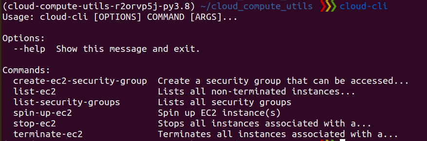

## How to deploy EC2 instances to AWS (in-bulk)

### Install 
1. `pip3 install poetry`  (poetry is the package manager used for this library)
2. `poetry shell`  - source into a virtual environment (create a new one if it doesn't exist)
3. `poetry install` - install the dependencies for this package

###  AWS helper CLI
* run `deployments-cli` - (this CLI will be added to your path during `poetry install`) 
  1. create-ec2-security-group  Create a security group that can be accessed from anywhere
  2. list-ec2                   Lists all non-terminated instances.
  3. list-security-groups       Lists all security groups
  4. spin-down-ec2              Spins down all instances associated with a specific keyname-pair
  5. spin-up-ec2                Spin up EC2 instance(s)

Note about Spin-up-ec2, it is recommended that you spin up using a permissioned file that you already have saved in AWS
pem-file. The public/secret pem-file combo should be saved in AWS under a specific name. When running `spin-up-ec2` provide that name, as `spin-up-ec2 -k <keypair_name>`.

Note: run `deployments-cli --help` or `deployments-cli <subcommand> --help` for help.

### Spinning up EC2 instances using a CLI

1. You need to create a security group that can be accessed from anywhere first. So use : `deployments-cli create-ec2-security-group -v <vpc-id>`  and then  `deployments-cli list-security-groups` to create such a security group. It will print out something of the form `sg-0da77507b0dfbec4c` (Note the first call may error out, if the security group already exists)
2. Then you need to create EC2 instances that are attached to that security group, use : `deployments-cli spin-up-ec2 -k <ec2-keypair> -N ## -s <security-group-id>`
3. Then to confirm their status run `deployments-cli list-ec2 -k <ec2-keypair>`
4. When done, run `deployments-cli spin-down-ec2 -k <ec2-keypair>`
   1. Note: if you do not include `-k <keypair>`, all instances will be shutdown. CAREFUL!
   
### Helpful Reference 
1.  https://boto3.amazonaws.com/v1/documentation/api/latest/guide/quickstart.html#installation
2. https://boto3.amazonaws.com/v1/documentation/api/latest/reference/services/ec2.html
3. https://stackoverflow.com/questions/13585857/how-to-launch-ec2-instance-with-boto-specifying-size-of-ebs
4. https://hands-on.cloud/working-with-ec2-instances-using-boto3-in-python/
5. https://docs.aws.amazon.com/AWSEC2/latest/UserGuide/ec2-security-groups.html
